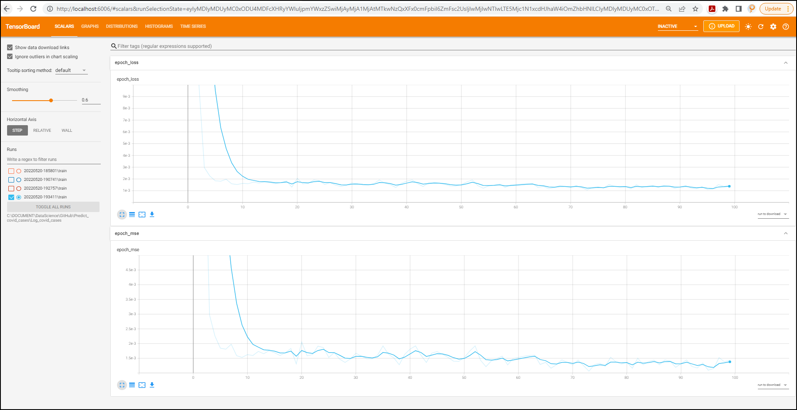

# Predict_covid_cases
 This model predict number of new cases in Malaysia based on past Covid19 cases data

# Description
This is a project built using deep learning model with LSTM neural network to predict Covid-19 new cases in Malaysia using the past 30 days of number of cases.

# How to use it
Clone the repo and run it.

Predict_covid_module.py is a script that contains the class module (WIP).

Predict_covid_cases.py is a script for deployment of the test dataset

Predict_covid_cases.h5 is the saved model

# Outcome

The 𝑀𝑒𝑎𝑛 𝐴𝑏𝑠𝑜𝑙𝑢𝑡𝑒 𝑃𝑒𝑟𝑐𝑒𝑛𝑡𝑎𝑔𝑒 𝐸𝑟𝑟𝑜𝑟 (MAPE) is 0.1380907 % 

20/20 [==============================] - 1s 72ms/step - loss: 0.0011 - mse: 0.0011
Epoch 97/100
20/20 [==============================] - 1s 68ms/step - loss: 0.0012 - mse: 0.0012   
Epoch 98/100
20/20 [==============================] - 1s 72ms/step - loss: 0.0015 - mse: 0.0015
Epoch 99/100
20/20 [==============================] - 1s 69ms/step - loss: 0.0014 - mse: 0.0014
Epoch 100/100
20/20 [==============================] - 1s 71ms/step - loss: 0.0014 - mse: 0.0014

Mean Absolute Percentage Error (MAPE) is [0.1380907] %

# Credit
Credit goes to MoH Malaysia for the dataset

https://github.com/MoH-Malaysia/covid19-public

# Images

### 1. Training model architecture

##
### 2. Training process plotted using Tensorboard

##
### 3. Number of Covid 19 cases (train data)

##
### 4. Number of Covid 19 cases (test data)

##
### 5. Number of Covid 19 cases graph - Predicted vs Actual

